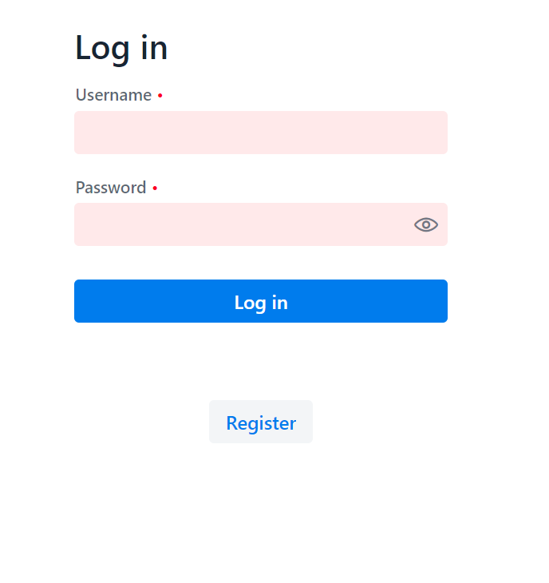
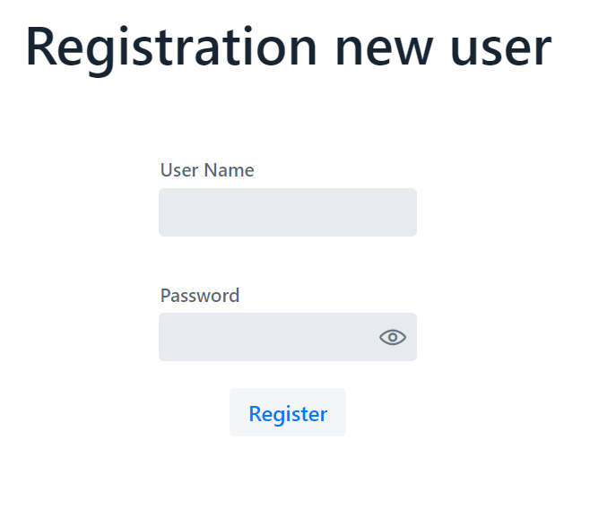

# Vaadin Spring Boot project

##Приложение "Список работников предприятия"

Разработано с применением Spring Boot и Vaadin фрэймворков.

Позволяет осуществлять авторизацию пользователя и выход из учетной записи.

Само приложение состоит из трех форм
- `Form` - подволяет добавлять в список новых сотрудников и их контактные данные (email)
- `List` - полный перечень всех сотрудников, хранимых в базе данных
- `Master-Detail` - перечень сотрудников + возможность добавления и редактирования

Для авторизации необходимо ввести login: max password: 1234 либо нажать на кнопку register и задать нового пользователя

Вся информация хранится в базе данных H2, которая создается в памяти при запуске приложения из заранее заданных schema.sql и data.sql (для удобства демонстрации)

Для запуска приложения можно использовать `mvn spring-boot:run` и перейти по ссылке [http://localhost:8080](http://localhost:8080).

## Что было сделано

- Сгенерирован проект на Vaadin, состоящий из трех форм.
- Подключена и настроена база данных H2 с возможностью создания базы в памяти из sql файлов при старте приложения
- Информация о работниках убрана из POJO класса и перенесена в базу данных H2
- Добавлена форма авторизации пользователей
- Подключен и настроен Spring Security
- Реализована возможность хранить учетные данные пользователей в базе данных
- Реализована возможность выхода пользователя из учетной записи
- Реализована возможность добавления нового пользователя в базу данных (регистрация)
- Добавление нового работника в базу данных из формы "Form"
- Добавление нового сотрудника в базу данных из формы "Master-Detail"

## Что будет делаться 

- Реализовать валидацию полей при добавлении нового работника
- Реализовать обновление данных сотрудника через форму "Master-Detail"

## Скриншоты

